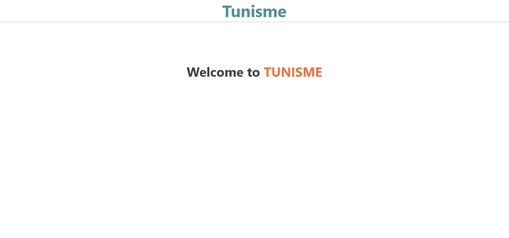
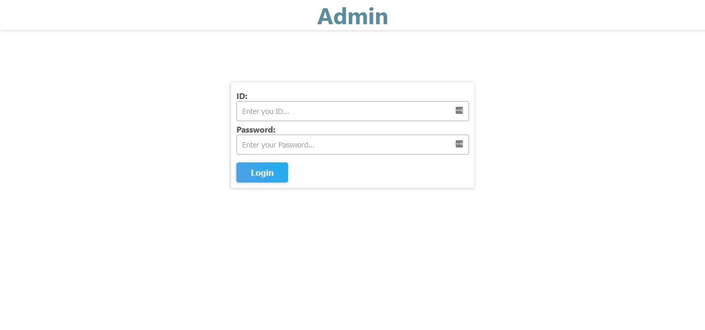

# tunisme

### Installation
1. Clone repo
``` $ git clone https://github.com/mwissem/tunisme.git ```
## TODO
- Add Admin Dashboard
- Add REST API
- Add Client (vuejs, vuex)

### Screenshots
1. Home Page (not complete yet ! )


2. Admin Login Page (75% complete  ! )

